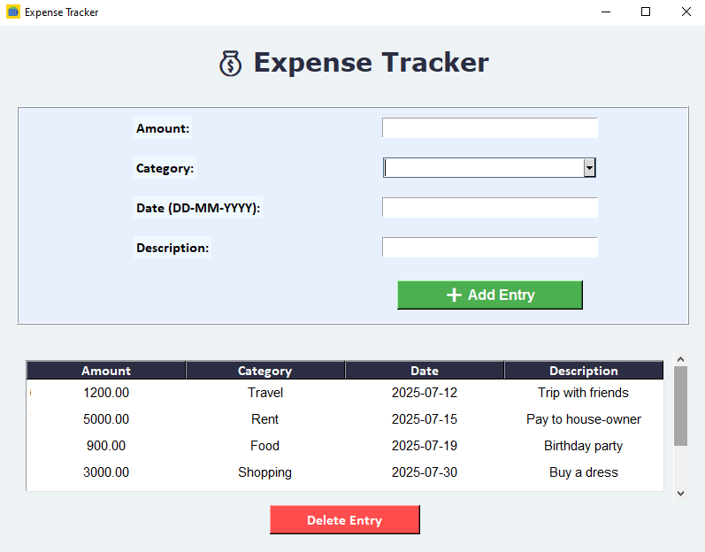

# 💸 Expense Tracker - Tkinter + MySQL

A simple and user-friendly GUI-based Expense Tracker application built using *Python, **Tkinter, and **MySQL*. It helps users manage and monitor their daily expenses effectively.

---

## 🚀 Features

- ✅ Add new expense entries (amount, category, date, description)
- 🗂 View all expenses in a table (Treeview)
- 🗑 Delete selected expenses
- 💾 MySQL database integration
- 🧼 Clear input fields after saving
- 📜 Scrollable table for large data
- 🖱 GUI with intuitive layout and design

---

## 🛠 Tech Stack

- *Python 3.x*
- *Tkinter* (GUI)
- *pymysql* (MySQL Connector)
- *MySQL* (Database)

---

## 🖼 Screenshots

### 🔹 Main GUI

